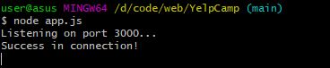
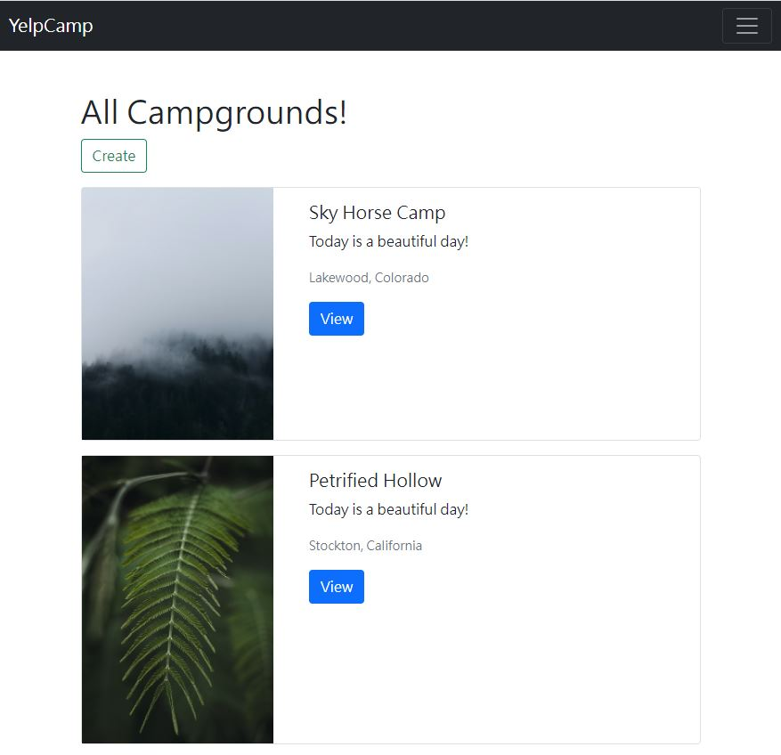

<h3> This is a practice project to build a website from backend to frontend.</h3>

You can follow the steps to build the website on your local machine.

This project is build on MongoDBv4.4.12 and NodeJSv16.13.1.
 

Make sure you have downloaded the needed software.

<ol>
    <li>Check "package.json" file to install the dependent packages</li>
    <li>Log in <a href="https://unsplash.com/">unsplash</a> to get the API public key</li>
    <li>Revise "seeds/photosHelper.mjs" accessKey to your public key</li>
    <li>Open up MongoDB(If you have problem, check this <a href="https://zarkom.net/blogs/how-to-install-mongodb-for-development-in-windows-3328">link</a>)</li>
    <li>Run "node 'seeds/index.js'" to insert random data into database</li>
    <li>Run "node 'app.js'" to open your website service</li>
    <li>
        
If successfully open, you will see the following message

        
    </li>
    <li>
        
Type "http://localhost:3000/campground" to see the websit

        
    </li>
</ol>

